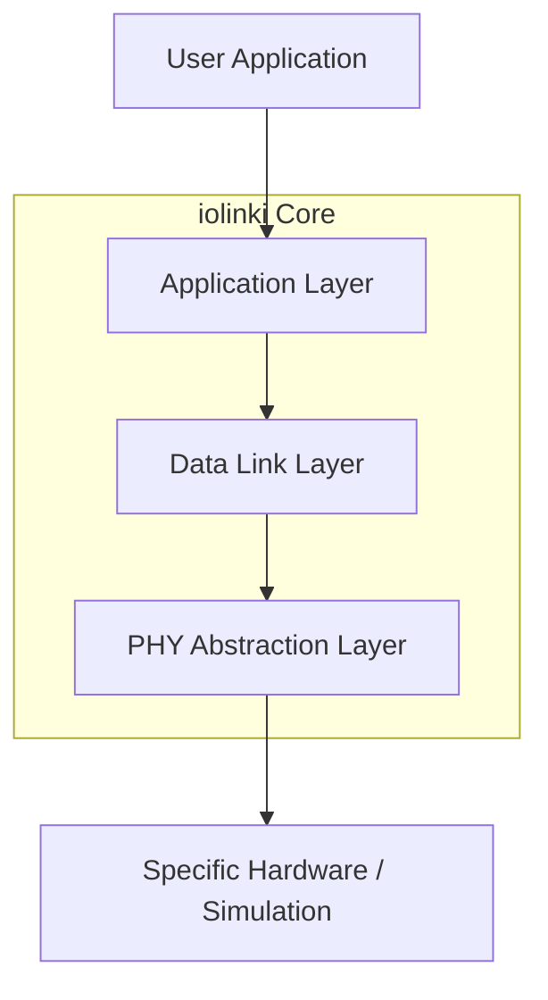

# iolinki Architecture

This document describes the high-level architecture of the `iolinki` IO-Link Device Stack. The primary design goal is **complete hardware independence**, enabling the stack to run on any MCU, RTOS, or even as a host-based simulation.

## 1. Layered Architecture

The stack follows a classic layered approach, strictly enforcing boundaries between hardware-specific operations and protocol logic.

### 1.1 Physical Layer (PHY) Abstraction
The `iolink_phy_api_t` (defined in `phy.h`) is the only point of contact with the hardware. It uses function pointers for:
- Initialization
- Mode switching (SIO vs SDCI)
- Baudrate configuration
- Byte-level or buffer-level transmission/reception

### 1.2 Data Link Layer (DLL)
The DLL (`dll.c`) implements the IO-Link state machine:
- **STARTUP**: Initial state, power-on synchronization.
- **PREOPERATE**: Parameter exchange and identification.
- **OPERATE**: Cyclic Process Data (PD) exchange.

### 1.3 Application Layer (AL)
The AL (`application.h`) provides the interface for the user application to interact with the stack without knowing protocol details.
- **Process Data API**: Acyclic and cyclic data access.
- **ISDU**: Indexed Service Data Unit for larger parameter sets (Planned).

## 2. Design Principles & MISRA Compliance

The codebase adheres to a subset of MISRA C:2012 guidelines to ensure safety and reliability in industrial environments.

### 2.1 No Dynamic Memory
All memory is statically allocated at compile time. There are no calls to `malloc`, `free`, or `realloc`. This prevents heap fragmentation and ensures deterministic behavior.

### 2.2 Strict Typing
Only fixed-width integer types from `<stdint.h>` are used (e.g., `uint8_t`, `uint16_t`, `uint32_t`) to ensure portability across different architectures (8-bit to 64-bit).

### 2.3 Modular Mocking (TDD)
The stack is built "test-first". Every layer is verified using CMocka mocks.
- `phy_mock`: Simulates hardware behavior.
- `phy_virtual`: Enables host-based E2E protocol testing.

### 2.4 Error Handling
All API functions return error codes (negative integers). Return values must be checked by the caller.

## 3. Processing Model
The stack uses a non-blocking, periodic processing model. The user application must call `iolink_process()` at a regular interval (typically 1ms) to drive the internal state machines and timers.
