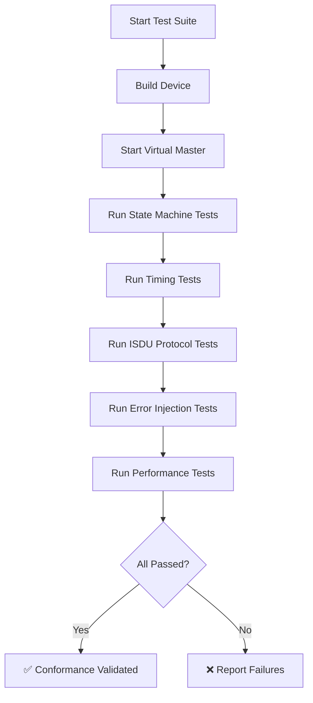

# IO-Link V1.1.5 Conformance Testing

## Overview

iolinki includes a comprehensive conformance test suite that validates compliance with the IO-Link V1.1.5 specification. The suite consists of **36 automated test cases** across 5 categories, executed via the Virtual IO-Link Master.

## Test Coverage Summary

| Category | Test Cases | Coverage |
|----------|-----------|----------|
| State Machine | 7 | DLL transitions, ESTAB_COM, fallback behavior |
| Timing Requirements | 5 | Cycle times, response delays, wake-up timing |
| ISDU Protocol | 13 | All mandatory indices + error handling |
| Error Injection | 6 | Recovery, robustness, edge cases |
| Performance | 5 | Sustained operation, stress testing |
| **Total** | **36** | **IO-Link V1.1.5 Device Specification** |

## Test Suites

### 1. State Machine Conformance (`test_conformance_state_machine.py`)

**Requirement**: IO-Link V1.1.5 Section 7.3 - DLL State Machine

| Test | Description | Validates |
|------|-------------|-----------|
| `test_01_startup_to_preoperate_transition` | Wake-up sequence | Wake-up request, M-sequence response, PREOPERATE entry |
| `test_02_preoperate_to_operate_transition` | PD length negotiation | PD length setup, M-sequence change, cyclic data start |
| `test_03_operate_state_persistence` | State retention | 10 consecutive PD exchanges without errors |
| `test_04_communication_fallback_behavior` | Baud rate fallback | COM1 (4.8 kbaud) mandatory support |
| `test_05_invalid_state_transition_rejection` | Error handling | Graceful rejection of invalid transitions |
| `test_06_isdu_during_operate` | Concurrent operations | ISDU access while PD exchange active |
| `test_07_estab_com_to_operate_transition` | ESTAB_COM state | Transition command → ESTAB_COM → OPERATE on first valid frame |

**Coverage**: Startup → PREOPERATE → ESTAB_COM → OPERATE transitions, COM rate fallback, concurrent PD/ISDU operations.

---

### 2. Timing Requirements (`test_conformance_timing.py`)

**Requirement**: IO-Link V1.1.5 Section 6.2.2 - Communication Timing

| Test | Description | Validates |
|------|-------------|-----------|
| `test_01_cycle_time_com1` | COM1 cycle time | Minimum cycle time > 5ms, < 100ms |
| `test_02_isdu_response_time` | ISDU response delay | Response time < 1 second |
| `test_03_wakeup_timing` | Wake-up sequence | Wake-up completion < 200ms |
| `test_04_pd_exchange_consistency` | Timing jitter | PD cycle jitter < 50% of average |
| `test_05_wakeup_timing_path_compliance` | Wake-up timing path | t_dwu (80μs) compliance, AWAITING_COMM state |

**Coverage**: Cycle time validation, ISDU response timing, wake-up delays, wake-up timing path (t_dwu), timing consistency.

---

### 3. ISDU Protocol Validation (`test_conformance_isdu.py`)

**Requirement**: IO-Link V1.1.5 Section 8 - ISDU Specification

| Test | ISDU Index | Parameter | Access |
|------|-----------|-----------|--------|
| `test_01_vendor_name_0x0010` | 0x0010 | Vendor Name | Read |
| `test_02_vendor_text_0x0011` | 0x0011 | Vendor Text | Read |
| `test_03_product_name_0x0012` | 0x0012 | Product Name | Read |
| `test_04_product_id_0x0013` | 0x0013 | Product ID | Read |
| `test_05_product_text_0x0014` | 0x0014 | Product Text | Read |
| `test_06_serial_number_0x0015` | 0x0015 | Serial Number | Read |
| `test_07_hardware_revision_0x0016` | 0x0016 | Hardware Revision | Read |
| `test_08_firmware_revision_0x0017` | 0x0017 | Firmware Revision | Read |
| `test_09_application_tag_0x0018_read_write` | 0x0018 | Application Tag | Read/Write |
| `test_10_device_access_locks_0x000C` | 0x000C | Device Access Locks | Read |
| `test_11_profile_characteristic_0x000D` | 0x000D | Profile Characteristic | Read |
| `test_12_min_cycle_time_0x0024` | 0x0024 | Min Cycle Time | Read |
| `test_13_invalid_index_error_handling` | 0xFFFF | (Invalid) | Error handling |

**Coverage**: All 12 mandatory ISDU indices, read/write operations, persistence (0x0018), error handling for invalid indices.

---

### 4. Error Injection & Recovery (`test_conformance_error_injection.py`)

**Requirement**: IO-Link V1.1.5 Section 7.3.5 - Error Handling

| Test | Description | Validates |
|------|-------------|-----------|
| `test_01_communication_loss_recovery` | Master dropout | Recovery after 500ms communication loss |
| `test_02_rapid_state_transitions` | State machine stress | 5 rapid wake-up cycles |
| `test_03_invalid_pd_length_handling` | Boundary condition | Rejection of PD length > 32 bytes |
| `test_04_concurrent_isdu_requests` | Flow control | ISDU Busy state handling |
| `test_05_boundary_condition_max_isdu_size` | Segmentation | 16-byte ISDU write/read |
| `test_05_error_recovery_sequence` | Full recovery | Functionality restoration after errors |
| `test_06_bad_crc_handling` | CRC error detection | Device detects and handles CRC errors |
| `test_07_crc_fallback_recovery` | CRC fallback | Fallback to COM1 after 3 CRC errors, full recovery |

**Coverage**: Communication loss, rapid state changes, invalid parameters, concurrent requests, boundary conditions, CRC fallback to COM1, full recovery sequences.

---

### 5. Performance & Stress Testing (`test_conformance_performance.py`)

**Requirement**: IO-Link V1.1.5 - General Reliability

| Test | Description | Validates |
|------|-------------|-----------|
| `test_01_sustained_pd_exchange` | 100 PD cycles | ≥ 90% success rate |
| `test_02_high_frequency_isdu_access` | 20 rapid ISDU reads | ≥ 15/20 success rate |
| `test_03_mixed_pd_and_isdu_load` | Concurrent traffic | Both PD and ISDU functional |
| `test_04_rapid_state_cycling` | 10 PREOPERATE↔OPERATE | ≥ 7/10 success rate |
| `test_05_long_duration_stability` | 30-second operation | ≥ 85% success rate |

**Coverage**: Sustained operation, high-frequency access, mixed workloads, state cycling, long-duration stability.

---

## Running Conformance Tests

### Individual Test Suite

```bash
# Run specific conformance test
python3 tools/virtual_master/test_conformance_state_machine.py
python3 tools/virtual_master/test_conformance_timing.py
python3 tools/virtual_master/test_conformance_isdu.py
python3 tools/virtual_master/test_conformance_error_injection.py
python3 tools/virtual_master/test_conformance_performance.py
```

### Full Validation Suite

```bash
# Runs all tests including conformance suite
./test_all.sh
```

### Docker Validation

```bash
# Runs all tests in isolated Docker environment
./run_all_tests_docker.sh
```

---

## Specification Coverage

### IO-Link V1.1.5 Sections Covered

- ✅ **Section 6.2.2**: Communication Rates (COM1/COM2/COM3)
- ✅ **Section 7.3**: DLL State Machine (Startup, PREOPERATE, OPERATE)
- ✅ **Section 7.3.2**: Wake-up Sequence
- ✅ **Section 7.3.3**: PD Length Negotiation
- ✅ **Section 7.3.4**: State Retention
- ✅ **Section 7.3.5**: Error Handling & Recovery
- ✅ **Section 8.1**: ISDU Acyclic Messaging
- ✅ **Section 8.1.2**: ISDU Segmentation
- ✅ **Section 8.1.3**: Concurrent PD/ISDU Operations
- ✅ **Section 9.1**: Process Data Exchange

### Mandatory ISDU Indices (100% Coverage)

| Index | Parameter | Status |
|-------|-----------|--------|
| 0x0010 | Vendor Name | ✅ Tested |
| 0x0011 | Vendor Text | ✅ Tested |
| 0x0012 | Product Name | ✅ Tested |
| 0x0013 | Product ID | ✅ Tested |
| 0x0014 | Product Text | ✅ Tested |
| 0x0015 | Serial Number | ✅ Tested |
| 0x0016 | Hardware Revision | ✅ Tested |
| 0x0017 | Firmware Revision | ✅ Tested |
| 0x0018 | Application Tag | ✅ Tested (R/W + Persistence) |
| 0x000C | Device Access Locks | ✅ Tested |
| 0x000D | Profile Characteristic | ✅ Tested |
| 0x0024 | Min Cycle Time | ✅ Tested |

### IO-Link V1.1.5 Specification Cross-Reference

The following table maps our conformance tests to specific sections of the **IO-Link Interface and System Specification V1.1.5** (IEC 61131-9):

| Test Category | Spec Section | Requirement | Test Coverage |
|---------------|--------------|-------------|---------------|
| Wake-up Sequence | 7.3.2 | Device must respond to wake-up request | `test_01_startup_to_preoperate_transition` |
| PD Negotiation | 7.3.3 | PD length must be negotiated before OPERATE | `test_02_preoperate_to_operate_transition` |
| State Retention | 7.3.4 | Device must maintain state during operation | `test_03_operate_state_persistence` |
| Error Recovery | 7.3.5 | Device must recover from communication errors | `test_01_communication_loss_recovery` |
| COM1 Support | 6.2.2 | COM1 (4.8 kbaud) is mandatory | `test_04_communication_fallback_behavior` |
| Concurrent ISDU/PD | 8.1.3 | ISDU must work during PD exchange | `test_06_isdu_during_operate` |
| ISDU Indices 0x0010-0x0018 | 8.2.1 | Mandatory device identification parameters | `test_01` through `test_09` (ISDU suite) |
| Device Access Locks | 8.2.1.30 | Index 0x000C must be readable | `test_10_device_access_locks_0x000C` |
| Profile Characteristic | 8.2.1.36 | Index 0x000D must indicate device profile | `test_11_profile_characteristic_0x000D` |
| Min Cycle Time | 8.2.1 | Index 0x0024 must be readable | `test_12_min_cycle_time_0x0024` |
| ISDU Segmentation | 8.1.2 | Support for multi-frame ISDU transfers | `test_05_boundary_condition_max_isdu_size` |
| Timing Requirements | 6.2.2, Table 12 | Cycle time and response delay limits | All timing tests |

---

## Test Execution Flow



---

## Success Criteria

For iolinki to be considered **IO-Link V1.1.5 conformant**, all 36 test cases must pass:

- **State Machine**: All 7 tests pass
- **Timing**: All 5 tests pass
- **ISDU Protocol**: All 13 tests pass
- **Error Injection**: All 6 tests pass
- **Performance**: All 5 tests pass

**Current Status**: ✅ All 36 tests passing (as of v0.8.0)

---

## Limitations & Future Work

### Not Yet Covered

- **EMC Robustness Testing**: Requires specialized hardware (per IO-Link Test Spec)
- **Safety Communication Layer (SCL)**: Not applicable (iolinki is a standard device stack)
- **Physical Layer Testing**: Requires oscilloscope and signal analysis
- **Multi-Master Scenarios**: Requires multiple master instances

### Planned Enhancements

- **IODD Validation**: Automatic IODD file generation and validation
- **Extended Stress Testing**: 24-hour continuous operation tests
- **Coverage Metrics**: Automated code coverage reporting
- **Certification Support**: Test report generation for official certification

---

## References

- [IO-Link Specification V1.1.5](https://io-link.com/en/Downloads/Downloads_public.php)
- [IO-Link Test Specification V1.1.5](https://io-link.com/en/Downloads/Downloads_public.php)
- Virtual Master implementation: `tools/virtual_master/`
- Conformance tests: `tools/virtual_master/test_conformance_*.py`

---

**Copyright (C) 2026 Andrii Shylenko**  
**License**: See [LICENSE](../LICENSE) and [LICENSE.COMMERCIAL](../LICENSE.COMMERCIAL)
